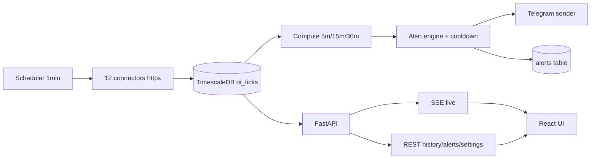

# OI Tracker — предметная область и требования к системе


Веб-сайт + Telegram-бот для отслеживания Open Interest (OI) на USDT-M перпетуальных фьючерсах. Автоматическое отслеживание всех торгуемых символов на биржах, расчёт изменений в скользящих окнах 5 / 15 / 30 минут, алерты в Telegram при пересечении настраиваемых порогов, история по каждой бирже отдельно.

*Документ отражает согласованное ТЗ: single-user веб + Telegram-бот, авто-сбор Open Interest по USDT-M perp на биржах раз в минуту, расчёт % изменений в окнах 5/15/30 мин, компактные алерты в Telegram, история 90 дней по каждой бирже отдельно.*

---

### 1. Цель и охват

Веб-сайт + Telegram-бот для одного пользователя, который:
- автоматически отслеживает все торгуемые USDT-M перпетуальные символы на биржах,
- раз в минуту собирает Open Interest и цену,
- считает % изменения в скользящих окнах ***5 / 15 / 30 минут***,
- шлёт алерты в Telegram при пересечении порогов,
- хранит историю 90 дней отдельно по каждой бирже.

### 2. Биржи

Binance, Bybit, OKX, Bitget, Gate.io, MEXC, KuCoin, HTX, Hyperliquid, Aster, Bitunix, XT.
1. Каждая = отдельный коннектор. 
2. Нормализация символов к единому виду `BASE` (например, `BTC-USDT-SWAP` у OKX → `BTC`).

**ВАЖНО**: В каждой биржи есть особенности нейминга символьных имен.
#### 1. Binance (USDS‑M / USDⓈ‑M Perpetual)
- Основной тип: USDⓈ‑M Perpetual («USDT‑M» в старом обиходе)
- Тип контракта в API: contractType = PERPETUAL + quoteAsset = USDT (или USDC, но тебя интересуют именно USDT‑M).
- Паттерн символа: BTCUSDT, ETHUSDT, AVAXUSDT, XRPUSDT, и т.д.
- Смысл: BASEQUOTE без суффиксов, где QUOTE = USDT и contractType = PERPETUAL. Это линейные фьючерсы, расчёт в USDT, перпетуальные, без даты экспирации.

#### 2. Bybit (USDT Perpetual / Linear)
- Основной тип: На сайте/в терминале: BTCUSDT, ETHUSDT и т.п.
- Тип контракта в API: В API Bybit v5 category = linear и settleCoin = USDT — это и есть USDT‑M perp.
- Паттерн символа: BTCUSDT, ETHUSDT, SOLUSDT, и т.д.
- Смысл: BASEUSDT для linear контрактов. Контракты перпетуальные; часто в интерфейсе обозначаются как USDT Perpetual / USDT-M.

#### 3. OKX (USDT‑M / USDⓈ‑M Perpetual / SWAP)
- Основной тип: В документации и UI OKX: BTC‑USDT‑SWAP, ETH‑USDT‑SWAP и т.п.
- Тип контракта в API: В документации и UI OKX: BTC‑USDT‑SWAP, ETH‑USDT‑SWAP и т.п.
- Паттерн символа: BTC-USDT-SWAP, ETH-USDT-SWAP, SOL-USDT-SWAP, и т.д.
- Смысл: BASE-USDT-SWAP — перпетуальный своп с маржой в USDT. Внутренне это эквивалент USDT‑M perp; quote = USDT, SWAP в конце.

#### 4. Bitget
- Основной тип: Bitget общепринято использует паттерн BASEUSDT для USDT‑линейных контрактов.
- Тип контракта в API: Для Coin‑M там могут быть BASEUSD или BASEUSD-PERP, для USDT‑perp — BASEUSDT.
- Паттерн символа: BTCUSDT, ETHUSDT, и т.д.
- Смысл: BASEUSDT + category = linear / settleCoin = USDT в деривативном API. USDT‑M перпетуалы линейные, без -SWAP или суффиксов, как на Binance.

#### 5. KuCoin
- Основной тип: UX‑интерфейс KuCoin: BTCUSDT Perp, ETHUSDT Perp.
- Тип контракта в API: В некоторых API/маркетах встречается XBTUSDTM (BTC/USDT USDT‑margined).
- Паттерн символа: BTCUSDT, XBTUSDTM (устаревший/альтернативный вариант того же контракта), и т.д.
- Смысл: BASEUSDT или XBTUSDTM для USDT‑margined perp; quote = USDT, settle = USDT, type = PERPETUAL в API.

#### 6. Gate.io
- Основной тип: Gate.io часто использует BASE_USDT_PERP или BASE_USDT для USDT‑M перпетуальных контрактов.
- Тип контракта в API: В документации и интерфейсе перпетуальные контракты часто помечаются USDT Margin или Perp.
- Паттерн символа: BTC_USDT, BTC_USDT_PERP, ETH_USDT, ETH_USDT_PERP, и т.д.
- Смысл: BASE_USDT / BASE_USDT_PERP — USDT‑M перпетуал; переплетается с USDC‑ и Coin‑M контрактами, но для USDT‑M перпетуальных это главный шаблон.

#### 7. MEXC (USDT‑M Perpetual)
- Основной тип: MEXC в UI: BTC/USDT, BTCUSDT и т.п., с указанием USDT-M / Linear слева или в выпадающем списке.
- Тип контракта в API: В API могут быть BTCUSDT, ETHUSDT, SOLUSDT и т.д.
- Паттерн символа: BTCUSDT, ETHUSDT, SOLUSDT, и т.д.
- Смысл: BASEUSDT для product_type = usdt / quote_type = usdt контрактов. USDT‑M перпетуалы линейные, похожи на Binance/Bybit по naming.

#### 8. HTX (Huobi / HTX)
- Основной тип: HTX переписалась в HTX, но legacy документы описывают BTCUSDT и BTCUSDT_PERP для USDT‑M перпетуалов.
- Тип контракта в API: TODAY behaviour: BTCUSDT, ETHUSDT и т.п. с contract_type = PERPETUAL и settle_coin = USDT.
- Паттерн символа: BTCUSDT, ETHUSDT, TCUSDT_PERP (в некоторых API‑ветках), и т.д.
- Смысл: BASEUSDT или BASEUSDT_PERP для USDT‑M перпетуалов, с contract_type = PERPETUAL.

#### 9. Hyperliquid
- Основной тип: Hyperliquid в интерфейсе и docs использует BTC-USDT, ETH-USDT, SOL-USDT и т.п. для перпетуальных контрактов, где базовый актив — монета, а USDT — стабильный парная валюта.
- Тип контракта в API: Hyperliquid в интерфейсе и docs использует BTC-USDT, ETH-USDT, SOL-USDT и т.п. для перпетуальных контрактов, где базовый актив — монета, а USDT — стабильный парная валюта.
- Паттерн символа: BTC-USDT, ETH-USDT, SOL-USDT, и т.д.
- Смысл: BASE-USDT — это их перпетуальный контракт, деноминированный/выведенный через USDT. USDT‑M перпетуалы, но без SWAP или PERP в названии, как в OKX/Bitget/Binance.

#### 10. Aster
- Основной тип: Aster пока не даёт единого чёткого публичного списка, но по структуре они похожи на Binance‑style; фьючерсы USDT‑M и COIN‑M встречаются в документации как BASEUSDT и BASEUSD.
- Тип контракта в API: Aster пока не даёт единого чёткого публичного списка, но по структуре они похожи на Binance‑style; фьючерсы USDT‑M и COIN‑M встречаются в документации как BASEUSDT и BASEUSD.
- Паттерн символа: BTCUSDT, ETHUSDT, SOLUSDT, и т.д.
- Смысл: BASEUSDT для USDT‑M перпетуалов, BASEUSD — для USD‑Coin‑M или инверсных контрактов. Надёжнее всего ориентироваться на contract_type = PERPETUAL и settle = USDT в их fapi/exchangeInfo‑ответе.

#### 11. Bitunix
- Основной тип: Bitunix использует BASEUSDT для USDT‑M перпетуалов, как и большинство современных CEX.
- Тип контракта в API: В документации trading_pairs для futures/market дают BTCUSDT, ETHUSDT и т.п.
- Паттерн символа: BTCUSDT, ETHUSDT, SOLUSDT, и т.д.
- Смысл: BASEUSDT для product_type = PERPETUAL / settle = USDT контрактов.

#### 12. XT
- Основной тип: XT в API future/market/v1/public/cg/contracts использует BASE_USD и BASE_USDT для разных контрактов; для USDT‑M перпетуалов — BASE_USDT, product_type = PERPETUAL.
- Тип контракта в API: В UI/маркетах видно BTC_USDT, ETH_USDT, SOL_USDT.
- Паттерн символа: BTC_USDT, ETH_USDT, SOL_USDT, и т.д.
- Смысл: BASE_USDT для product_type = PERPETUAL — это USDT‑M perp, в отличие от BASE_USD или Coin‑M контрактов.

## 3. ТЗ — функциональные требования
**Что строить**
Систему из 5 слоёв: collectors по биржам, normalizer, time-series storage, alert engine, delivery layer (веб + Telegram). Binance USDT-M даёт текущее OI и отдельную историческую статистику OI, Bybit даёт OI по linear контрактам с интервалами 5min/15min/30min, OKX имеет публичный open-interest для SWAP, KuCoin уже даёт futures OI с интервалами, а HTX публикует отдельный endpoint для contract open interest — это значит, что унифицированный слой нужен обязательно, потому что форматы и семантика у бирж отличаются.

*Практически это лучше делать так:*
- Сборщики только получают данные и пишут в raw_oi_samples.
- Нормализатор приводит всё к единой схеме.
- Агрегатор считает окна 5/15/30 минут из сырых точек.
- Алертер читает уже нормализованные метрики, а не ответы бирж напрямую.
- Веб и бот читают из БД/кэша, а не ходят в API бирж.

### 3.1 Сбор данных
Первое, что предстоит сделать - собрать данные с различных бирж. Каждая биржа = отдельный коннектор.
Делать это стоит как систему сбора таймсерий, а не как “бот, который иногда опрашивает API”. Для OI по десяткам/сотням символов на множестве бирж без потерь нужна архитектура с нормализацией символов, жёстким расписанием опроса, хранением сырых сэмплов, дедупликацией и отдельным контуром алертов.

**Главная сложность** в том, что у бирж разные единицы OI. Bybit прямо пишет, что для BTCUSDT linear open interest возвращается в базовом активе, а не в USDT; Binance в historical endpoint возвращает и sumOpenInterest, и sumOpenInterestValue, то есть лучше опираться либо на value-метрику, либо самим пересчитывать всё в notional USDT через mark/last price, иначе кросс-биржевое сравнение будет искажено.

*Поэтому в единую модель я бы заложил минимум такие поля:*
- exchange
- native_symbol
- canonical_symbol (BTCUSDT, ETHUSDT)
- market_type (usdt_perp)
- oi_native
- oi_notional_usdt
- price_used
- sample_ts_exchange
- sample_ts_system
- fetch_latency_ms
- status / error_code / raw_payload_hash

***Как собирать без потерь***
Не пытайся опрашивать “все символы всех бирж” одним циклом в лоб. Сначала каждая биржа должна регулярно обновлять список торгуемых USDT-M perpetual инструментов из своего symbol/instrument endpoint, затем планировщик создаёт задания по символам с лимитом concurrency и per-exchange rate limiting; для Binance это особенно важно, потому что open interest endpoint идёт по символу, а не пачкой.
**Надёжная схема такая:**
1. Каждые 5–10 минут обновляешь список активных контрактов по каждой бирже.
2. Для каждой биржи держишь свой async collector c httpx/aiohttp, connection pool и token bucket limiter.
3. Сохраняешь каждый успешный ответ как raw-event в БД.
4. Если биржа не ответила, пишешь heartbeat/error-event, а не “пропускаешь молча”.
5. Для окон 5/15/30 минут считаешь изменение по последней точке не “по wall clock”, а по ближайшей валидной точке не старше допустимого лага.
*Чтобы реально не терять данные, нужен не только polling, но и контроль качества:*
- collector_lag_seconds по бирже и символу.
- missing_samples_count
- stale_symbol если последняя точка старше, например, 2–3 интервалов.
- duplicate_payload_rate.
- symbol_coverage_ratio = сколько активных символов получили сэмпл в текущем цикле. Это позволит видеть деградацию раньше, чем пользователь заметит пропуски.

#### 3.1.1 Работа коннекторов
Ниже — рабочий принцип коннектора для каждой биржи именно под твою задачу: сбор OI по USDT-M perpetual, расчёт 5/15/30 минут, история по бирже отдельно, минимум потерь и нормальная отказоустойчивость. Там, где биржа уже даёт готовые OI-интервалы, коннектор должен брать их как первичный источник; там, где есть только текущее значение, ты сам строишь таймсерию из частых сэмплов.

**Общий шаблон**
У всех коннекторов должен быть один и тот же каркас: discover instruments → fetch OI → normalize → persist raw → compute windows → emit alerts. Binance current OI endpoint требует symbol и возвращает текущее значение со временем, Bybit и KuCoin уже отдают интервальные OI-значения, а XT вообще включает open_interest в ответе по списку контрактов, поэтому логика на уровне адаптера должна быть разной, а интерфейс наверху — одинаковым.

***Базовый интерфейс*** коннектора лучше сделать таким:
- sync_instruments()
- fetch_snapshot(symbol)
- fetch_range(symbol, interval, start, end) если биржа умеет историю
- normalize_symbol()
- normalize_oi_unit()
- healthcheck()
- rate_limit_policy()

**ВАЖНО:** Нюансы для каждой биржи находятся в файле `SPEC.md`

---
- Опрос каждой биржи **раз в 1 минуту** (выровнено по минуте).
- При каждом цикле обновляется список символов — **новые листинги подхватываются автоматически**, делистнутые перестают опрашиваться (история сохраняется).
- Биржа недоступна → тик пропускается, ошибка в лог, ретрай на следующей минуте. Падение одной биржи не ломает остальные.
- Минимальный объём данных в тике: `timestamp, exchange, symbol, oi_usd, price`.
---

#### 3.1.2 Нормализация
Normalizer — это центральный слой приведения биржевых данных к одной канонической модели. Он не ходит в биржи сам, а получает от коннекторов сырые payload’ы и превращает их в стандартные записи, чтобы дальше storage, окна 5/15/30 минут, алерты и веб/Telegram вообще не знали, откуда именно пришли данные — от Binance snapshot, Bybit interval API или XT bulk-list.

Если коротко: коннектор отвечает на вопрос “что вернула биржа”, а normalizer — на вопрос “что это значит в нашей системе”. Это особенно важно, потому что Binance current OI возвращает openInterest + symbol + time, Bybit явно указывает, что для BTCUSDT(linear) OI приходит в BTC, а XT отдаёт open_interest в контрактах вместе с contractSize, то есть без normalizer ты не можешь честно сравнивать биржи между собой.

**Главная задача**
*У normalizer четыре обязанности:*
- привести символ к canonical_symbol;
- понять, в чём измерен OI;
- пересчитать его в единую метрику oi_notional_usdt;
- выдать одну унифицированную запись для time-series storage.

*То есть на входе может быть:*
- Binance: BTCUSDT, openInterest=10659.509, time=...
- Bybit: BTCUSDT, openInterest=..., unit = BTC для linear
- XT: eth_usd, open_interest=2419347630, contractSize=10, underlyingType=1

*А на выходе normalizer должен сделать примерно такой объект:*
```json
{
  "exchange": "bybit",
  "native_symbol": "BTCUSDT",
  "canonical_symbol": "BTCUSDT",
  "market_type": "usdt_perp",
  "ts_exchange": 1714478700000,
  "oi_native": "1234.56",
  "oi_native_unit": "BTC",
  "price_ref": "75541.00",
  "oi_notional_usdt": "93264129.96",
  "normalization_status": "ok"
}
```

#### Вход нормализатора
На вход normalizer не должны попадать “голые числа”. Он должен получать enriched raw event от коннектора, где есть:
- exchange
- endpoint
- raw_payload
- fetched_at
- http_status
- instrument_metadata
- price_context

*Потому что часто самого OI-ответа недостаточно для нормализации: Bybit сообщает unit в документации, XT требует contractSize, а Binance historical endpoint отдельно даёт sumOpenInterestValue, который иногда лучше взять как ready-made notional value.*

То есть normalizer работает не только по payload, но и по контексту инструмента. Это важный принцип: normalization = payload + instrument spec + price spec + exchange rules.

#### Этапы нормализатора
1. Exchange parser
Сначала normalizer выбирает exchange-specific parser. Это ещё не “отдельный контур”, а просто модуль правил:
- parse_binance_open_interest()
- parse_bybit_open_interest()
- parse_xt_contract_snapshot()
- и так далее.

*Его задача — достать сырые поля в промежуточный внутренний вид:*
```python
ParsedOI(
    native_symbol="eth_usd",
    oi_raw="2419347630",
    oi_unit_hint="contracts",
    ts_exchange=1698681600000,
    product_type="PERPETUAL",
    settle_hint="USDT-M"
)
```

2. Instrument resolution
Потом normalizer должен понять, что это за рынок в нашей системе. Для этого нужен instrument registry, где лежит справочник инструментов по всем биржам.
*Пример:*
- Binance BTCUSDT → canonical BTCUSDT
- OKX BTC-USDT-SWAP → canonical BTCUSDT
- XT btc_usd + underlyingType=1 → canonical BTCUSDT или BTCUSD, в зависимости от реального режима контракта.

*На этом этапе решаются:*
- canonical_symbol
- base_asset
- quote_asset
- settle_asset
- market_type
- contract_type
- contract_size
- multiplier
- is_usdt_m

***Если инструмент не удалось однозначно разрешить, запись не должна теряться. Она уходит в normalization_dead_letter со статусом instrument_unresolved.***

3. Unit resolution
Дальше normalizer должен понять, в чём именно выражен OI:
- в base asset;
- в quote asset;
- в USD/USDT notional;
- в контрактах.

Это критический шаг. Bybit прямо пишет: BTCUSDT(linear) — OI в BTC, а не в USDT. XT пишет open_interest в contracts и отдельно даёт contractSize. Binance historical endpoint уже даёт и sumOpenInterest, и sumOpenInterestValue.

Значит, в normalizer должен быть rule engine вроде:
```python
if exchange == "bybit" and category == "linear":
    oi_unit = base_asset
elif exchange == "xt" and field == "open_interest":
    oi_unit = "contracts"
elif exchange == "binance" and endpoint == "openInterestStatistics":
    oi_unit = "contracts_or_native"
    oi_notional_usdt = sumOpenInterestValue
```

4. Price attachment
Если биржа не дала notional OI сразу, normalizer должен прикрепить цену. Обычно для этого используется:
- mark price, если доступен;
- index price, если mark нет;
- last price как fallback.

*Например:*
- Bybit OI в BTC → домножаешь на mark/last BTCUSDT.
- XT OI в контрактах → contracts * contractSize * price_factor. Тут формула зависит от структуры контракта и должна быть завязана на instrument spec.
- Binance statistics может уже дать sumOpenInterestValue, и тогда пересчёт не нужен.

***Это означает, что у normalizer должен быть доступ к price_context_cache, а не только к OI-ответу.***

5. Canonical conversion
A. Normalized sample
```python
NormalizedOISample(
    exchange="binance",
    native_symbol="BTCUSDT",
    canonical_symbol="BTCUSDT",
    ts_exchange=1589437530011,
    ts_ingested=...,
    oi_native=Decimal("10659.509"),
    oi_native_unit="BTC",
    oi_notional_usdt=Decimal("..."),
    price_used=Decimal("..."),
    source_kind="snapshot",
    normalization_version=3
)
```

B. Quality envelope
```python
NormalizationMeta(
    status="ok",
    confidence="high",
    unit_resolution_method="exchange_rule",
    price_resolution_method="mark_price_cache",
    raw_hash="...",
    warnings=[]
)
```

***Нужно хранить и данные, и метаданные нормализации.***

**ВАЖНО:** что именно должен делать normalizer по биржам описано в файле `NORMALIZER.md`

---

### 3.2 Преобразования данных в окна
Time‑series storage — это слой, который превращает нормализованные OI‑отсчёты в быстрые временные ряды для окон 5/15/30 минут, алертов и UI. В идеале он работает в режиме append‑only (новые точки только добавляются, не обновляются), использует time‑based partitioning, continuous aggregates для готовых окон и retention policies против бесконечного роста данных. TSDB‑решения вроде PostgreSQL + TimescaleDB заточены именно под такой workload: миллионы точек OI разных бирж и символов, агрегации по 5/15/30 минут и запросы по выбранным exchange + symbol.

**ВАЖНО:** подробная информация в Time‑series storage изложена в `TIME_SERIES_STORAGE.md`

---

### 3.3. Детектирование события
Alert engine — это сигнальный слой, который читает уже нормализованные и агрегированные OI‑ряды, проверяет пользовательские правила и решает, когда действительно отправлять алерт, а когда молчать. Его задача не “увидеть число выше порога”, а детектировать событие: пересечение порога, подтверждение на нескольких точках, отсутствие дублей, cooldown и восстановление состояния.

Именно поэтому alert engine нельзя делать как if delta > threshold: send(). Bybit прямо предупреждает, что при экстремальной волатильности возможны задержки delivery данных, Binance и KuCoin дают интервальные OI 5m/15m/30m, а значит движок должен учитывать и латентность источника, и тип источника, и качество свежести данных перед отправкой сигнала.

**ВАЖНО:** подробная информация о Alert engine в `ALERT_ENGINE.md`

---

### 3.4 Расчёт дельт

Для каждой пары `(exchange, symbol)` на каждом свежем тике:

- `Δ_N = (OI_now − OI_(now−N)) / OI_(now−N) × 100%`, где `N ∈ {5, 15, 30}` минут.
- Если точки ровно на `t−N` нет — берём ближайшую внутри `±90 сек`; иначе дельта = `null` и алерт не считается.
- Считается только относительное изменение в процентах (без абсолютов).

**ВАЖНО! НУЖНО:** Переформулировать расчёт дельты: Δ по OI в монетах, а oi_usd = oi_coins × price — производное поле.

---

### 3.5 Алерты

- Пороги задаются **per-window** отдельно для роста и падения: `up_5m, down_5m, up_15m, down_15m, up_30m, down_30m` (в %).
- **Cooldown per (symbol, exchange, window)**: после срабатывания алерт по этой комбинации блокируется на N минут (по умолчанию 15).
- Срабатывание = переход через порог на свежем тике (rising edge). Пока условие не «отпустило» порог обратно и не прошёл cooldown — повторов нет.
- **Защита от шума на новых листингах**: алерты включаются только когда у символа есть ≥ 30 мин собственной истории на этой бирже.
- Whitelist бирж (отключение отдельных) и blacklist символов (полное исключение).

---

### 3.6 Формат алерта (Telegram)

Компактный, **1 сработавшее окно = 1 сообщение**:

```
BTC @ Binance
+6.2% за 5мин
OI: $1.24B   Цена: $67,420
```

Бот **только исходящий**, без команд и обработки сообщений от пользователя.

---

### 3.7 Веб-интерфейс (single-user, без авторизации)

- **Dashboard** — live-таблица: `exchange | symbol | OI | Δ5m | Δ15m | Δ30m | price`. Сортировка по любой колонке, фильтры по бирже/тикеру/диапазону дельт. Обновление каждые ~5 сек.
- **Symbol page** (`/symbol/:symbol`) — один график OI по выбранному периоду (1ч / 6ч / 24ч / 7д / 30д / 90д), **все 12 бирж как отдельные линии на одном графике**. Легенда с включением/выключением линий.
- **Alerts log** — журнал всех сработавших алертов (фильтры: время, символ, биржа, окно).
- **Settings** — пороги 5/15/30 мин (up/down), cooldown, вкл/выкл бирж, blacklist символов, Telegram bot token + chat_id.

---

### 3.8 Хранение

- История **90 дней**, без downsampling.
- Daily-job удаляет тики старше 90 дней.
- История каждой биржи независима (один и тот же символ на Binance и Bybit = два независимых временных ряда).

---

## 4. Технический стек (выбран как оптимальный под задачу)

- **Backend**: Python 3.12 + FastAPI + asyncio + `httpx.AsyncClient` (12 коннекторов параллельно).
- **БД**: PostgreSQL 16 + расширение TimescaleDB — гипертаблица для `oi_ticks` идеально подходит: ~12 бирж × ~300 символов × 1440 точек/сутки ≈ 5М записей/день.
- **Frontend**: React + Vite + TypeScript, Recharts для графика, TanStack Table для live-таблицы, обновления через SSE.
- **Telegram**: `aiogram` 3.x в режиме «только sender» (без long polling).

---

## 5. Поток данных



---

## 6. Структура репозитория

```
traadefi/
  backend/
    app/
      exchanges/          # base.py + 12 коннекторов
      core/
        scheduler.py      # asyncio loop, выровнен по минуте
        deltas.py         # окна 5/15/30
        alerts.py         # пороги + cooldown + новый символ <30мин
        retention.py      # daily cleanup >90д
      api/                # /api/live, /api/history, /api/alerts, /api/settings + SSE
      db/                 # SQLAlchemy + Alembic
      telegram/sender.py
      config.py
    pyproject.toml
    Dockerfile
  frontend/
    src/pages/            # Dashboard.tsx, Symbol.tsx, Alerts.tsx, Settings.tsx
    package.json
    Dockerfile
  docker-compose.yml
  .env.example
  README.md
```

---

## 7. Схема БД (ключевое)

- `exchanges (id, code, name, enabled)` — 12 строк.
- `symbols (id, exchange_id, symbol, first_seen_at, last_seen_at, blacklisted)`.
- `oi_ticks (time, exchange_id, symbol_id, oi_usd, price)` — Timescale hypertable, retention 90д, индекс по `(exchange_id, symbol_id, time DESC)`.
- `alerts (id, time, exchange_id, symbol_id, window_min, delta_pct, oi_usd, price)`.
- `settings (key, value_json)` — пороги, cooldown, TG-креды.
