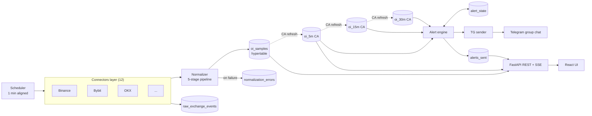
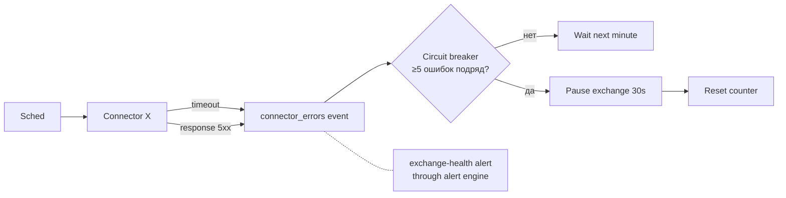
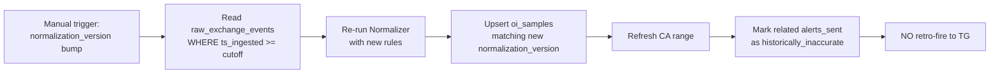

# 02 · Architecture

> Высокоуровневая архитектура oi-tracker: компоненты, поток данных, стек, deployment.
> Связано: `00_DECISIONS_LOG.md` (источник решений), `01_PRODUCT_SPEC.md` (что строим).

---

## 1. Components

### 1.1 Слои системы

```
┌─────────────────────────────────────────────────────────────────┐
│                        DELIVERY LAYER                           │
│  ┌──────────────┐ ┌─────────────────┐ ┌────────────────┐        │
│  │ FastAPI REST │ │ FastAPI SSE     │ │ aiogram TG     │        │
│  │ /api/...     │ │ /sse/live       │ │ sender-only    │        │
│  └──────┬───────┘ └────────┬────────┘ └───────┬────────┘        │
│         │                  │                  │                 │
└─────────┼──────────────────┼──────────────────┼─────────────────┘
          │                  │                  │
┌─────────▼──────────────────▼──────────────────▼─────────────────┐
│                       ALERT ENGINE                              │
│  ┌──────────────┐ ┌────────────────┐ ┌────────────────────┐     │
│  │ Rule matcher │ │ State machine  │ │ Smart cooldown +   │     │
│  │              │ │ idle/armed/... │ │ Dedupe + Quality   │     │
│  └──────────────┘ └────────────────┘ └────────────────────┘     │
└─────────┬──────────────────┬──────────────────┬─────────────────┘
          │                  │                  │
┌─────────▼──────────────────▼──────────────────▼─────────────────┐
│                  TIME-SERIES STORAGE (TimescaleDB)              │
│  ┌────────────────┐ ┌─────────────────┐ ┌────────────────────┐  │
│  │ oi_samples     │ │ oi_5m / oi_15m  │ │ alert_state /      │  │
│  │ (hypertable)   │ │ /oi_30m (CA)    │ │ alerts_sent / ...  │  │
│  └────────────────┘ └─────────────────┘ └────────────────────┘  │
└─────────▲───────────────────────────────────────────────────────┘
          │
┌─────────┴───────────────────────────────────────────────────────┐
│                       NORMALIZER                                │
│  ┌──────────┐ ┌─────────────┐ ┌──────────┐ ┌────────────────┐   │
│  │ Exchange │ │ Instrument  │ │ Unit     │ │ Price + Quality│   │
│  │ parser   │ │ resolver    │ │ resolver │ │ assessor       │   │
│  └──────────┘ └─────────────┘ └──────────┘ └────────────────┘   │
└─────────▲───────────────────────────────────────────────────────┘
          │
┌─────────┴───────────────────────────────────────────────────────┐
│                       CONNECTORS LAYER                          │
│  ┌──────────┐ ┌──────────┐ ┌──────────┐ ┌──────────┐  ...       │
│  │ Binance  │ │ Bybit    │ │ OKX      │ │ Bitget   │  (12)      │
│  │ snapshot │ │ native   │ │ snapshot │ │ snapshot │            │
│  └──────────┘ └──────────┘ └──────────┘ └──────────┘            │
│            ▲ all share BaseConnector interface                  │
└─────────────────────────────────────────────────────────────────┘
                          │
                  ┌───────▼────────┐
                  │   SCHEDULER    │
                  │ asyncio loop   │
                  │ minute-aligned │
                  └────────────────┘
```

### 1.2 Описание компонентов

| Слой | Назначение | Файл-спецификация |
|---|---|---|
| **Scheduler** | Async loop, выровненный по минутам, инициирует циклы сбора. | `02_ARCHITECTURE.md §5` |
| **Connectors (×12)** | Per-exchange коннекторы, каждый реализует `BaseConnector`. Сырые ответы → raw_exchange_events. | `11_EXCHANGE_ADAPTERS/_BASE_CONNECTOR.md` + per-exchange |
| **Normalizer** | 5-стадийный pipeline: parser → instrument resolver → unit resolver → price attachment → quality assessor. | `07_NORMALIZER.md` |
| **Time-series storage** | TimescaleDB hypertables (`oi_samples`, `volume_samples_5m`) + continuous aggregates 5m/15m/30m + retention/compression. | `08_TIME_SERIES_STORAGE.md` |
| **Aster volume polling (F51)** | Отдельный supervisor task `_aster_volume_lifecycle`, 60s cadence, тянет `/fapi/v1/klines?interval=5m` → `volume_samples_5m`. Aster-only: 5m OI на Aster нерепрезентативен (cadence 5-25 мин), volume — основной 5m-сигнал. | `00_DECISIONS_LOG F51` + `11_EXCHANGE_ADAPTERS/aster.md §3.4` |
| **Alert engine** | State machine, 5 типов сигналов (включая `volume_threshold` для Aster@5m), smart cooldown, dedupe. | `09_ALERT_ENGINE.md` |
| **Delivery layer** | FastAPI REST + SSE + aiogram TG sender. Templates: `oi_threshold_cross`, `volume_threshold_cross`, `divergence_alert`, `exchange_health_alert`. | `10_DELIVERY_LAYER.md` |
| **Instrument registry** | Master data, sync каждые 5 мин. | `06_INSTRUMENT_REGISTRY.md` |
| **Observability** | Prometheus + Grafana + Loki. | `12_OBSERVABILITY_SLO.md` |

---

## 2. Tech stack

### 2.1 Backend

| Компонент | Технология | Версия | Обоснование |
|---|---|---|---|
| Язык | Python | 3.12 | Современная типизация, asyncio production-ready, богатая экосистема для time-series и финансов. |
| Web framework | FastAPI | ≥ 0.110 | Native async, OpenAPI авто-генерация, dependency injection, отличная интеграция с pydantic. |
| HTTP client | httpx | ≥ 0.27 | Native async, connection pooling, HTTP/2, удобная работа с retry. |
| TG bot | aiogram | 3.x | Async-first, sender-only режим без long polling. |
| ORM/SQL | SQLAlchemy 2.x Core + asyncpg | ≥ 2.0 / ≥ 0.29 | Async, типизированные запросы; asyncpg — самый быстрый драйвер PostgreSQL. **Используем только SQLAlchemy Core** (см. §2.1.1 ниже); ORM session не используется. |
| Migrations | Alembic | ≥ 1.13 | Стандарт de-facto для SQLAlchemy. |
| Validation | pydantic | 2.x | Контракты данных, автогенерация JSON Schema. |
| Decimal math | `decimal.Decimal` | stdlib | Финансовая точность; NUMERIC ↔ Decimal на границе БД. |
| Scheduling | `asyncio` + `asyncio.Event` | stdlib | Не нужен внешний шедулер для 1 пользователя на 1 сервере. |
| Testing | pytest + pytest-asyncio | ≥ 8.0 / ≥ 0.23 | Стандарт. |
| Logging | `structlog` + Loki handler | ≥ 24 | Structured JSON-логи. |

#### 2.1.1 Storage access strategy (ADR, pre-M1)

| Слой | Доступ к БД | Обоснование |
|---|---|---|
| **Hot-path bulk insert** (`storage.repositories.oi_samples.bulk_insert`) | `asyncpg` напрямую через `pool.executemany(...)` с raw SQL из `08 §4.1`. | 3600 строк за 50–100ms требует минимального overhead'а; SQLAlchemy ORM/Core добавляют сериализацию и проверки, не нужные на hot-path. |
| **Не-hot мутации API** (settings update, alert_rules CRUD, instruments registry sync) | SQLAlchemy 2.x Core (`select(...)`, `insert(...)`, `update(...)`) через `AsyncEngine`. | Типизированные query builders без overhead full ORM session; параметризация защищает от SQL injection (см. F14, ruff S608). |
| **Read-only API queries** (live dashboard, history, alerts feed) | SQLAlchemy Core + raw SQL через `text(...)` для сложных запросов с CTE/window funcs из `08 §5`. | CTE и window-функции писать через ORM expression API — антипаттерн; raw SQL читаемее. Параметризация через `:param`. |
| **Migrations** | Alembic + `op.execute(text(...))` для TimescaleDB-specific операций. | См. `08 §13`. |

**Что НЕ делаем:**
- **Не используем `AsyncSession` / SQLAlchemy ORM mapped models.** Причины: (1) `mypy --strict` + Pydantic v2 + ORM-mapped модели требуют декларативных `Mapped[T]` колонок и выливаются в три представления одной таблицы (DDL / Mapped class / Pydantic schema). Domain — Pydantic, БД — SQL. Маппинг между ними руками в repository — короче и яснее. (2) Hot-path всё равно идёт мимо ORM. Иметь две стратегии работы с БД в одном кодбейсе — техдолг.
- **Не используем ORM relationship loading / lazy load.** Все JOIN'ы — explicit в Core или raw SQL.

Эта стратегия — pre-M1 ADR; зафиксирована, чтобы избежать смешения двух стилей доступа в коде. См. `16_ROADMAP §Pre-milestone prerequisites`.

### 2.2 Storage

| Компонент | Технология | Версия | Обоснование |
|---|---|---|---|
| RDBMS | PostgreSQL | 16.x | Стабильная LTS, отличная асинхронная поддержка. |
| Time-series ext | TimescaleDB | ≥ 2.13 | Hypertables, continuous aggregates, native compression — заточено под наш workload. |

### 2.3 Frontend

| Компонент | Технология | Версия | Обоснование |
|---|---|---|---|
| Framework | React | 18+ | Зрелый, известный пользователю. |
| Build | Vite | 5+ | Быстрая разработка, простая конфигурация. |
| Language | TypeScript | 5+ | Типобезопасность, особенно для контрактов с backend. |
| Charts | Recharts | ≥ 2.12 | Простой API, достаточно для линейных графиков OI; для 12-line × 90d — серверная децимация. |
| Tables | TanStack Table | v8 | Сортировка, фильтры, виртуализация для больших таблиц. |
| HTTP | fetch + EventSource | native | SSE для real-time, REST для запроса/мутации. |
| Styling | Tailwind CSS | 3+ | Быстрая разработка UI single-user приложения. |

### 2.4 Observability

| Компонент | Технология | Версия | Обоснование |
|---|---|---|---|
| Metrics | Prometheus | 2.x | Pull-based, метрики из FastAPI через `prometheus_client`. |
| Dashboards | Grafana | 10+ | Стандарт; готовые TS-плагины. |
| Logs | Loki + promtail | 2.9+ | Лёгкий аналог ELK для одной машины. |
| Alerting (внутреннее) | Alertmanager | 0.27+ | Алерты на падение коннекторов, disk full, latency P99 > порога. |

### 2.5 OS / Process management

| Компонент | Технология | Обоснование |
|---|---|---|
| OS | Ubuntu Server LTS (22.04 / 24.04) | Стабильный, длительный support, типовой выбор. |
| Process manager | systemd | Стандарт; auto-restart, journal-логи, timer-юниты. |
| Reverse proxy | nginx | Терминирует TLS (если нужен), статика frontend, проксирует FastAPI. |
| Python deps | `uv` или `pip + venv` | `uv` быстрее, но `pip + venv` — стандарт; выбор на этапе реализации. |

---

## 3. Data flow

### 3.1 Поток в нормальном режиме



**Ключевые моменты:**
- `raw_exchange_events` — append-only хранилище сырых payload'ов; нужен для replay.
- Continuous aggregates (CA) обновляются автоматически TimescaleDB (refresh policy каждые 30 секунд).
- `oi_15m` строится поверх `oi_5m`, `oi_30m` — поверх `oi_5m` (hierarchical CA).
- Alert engine читает CA, не сырые точки.
- `alert_state` — постоянное состояние state machine, переживает рестарты.

### 3.2 Поток при ошибке коннектора



### 3.3 Поток reprocessing



---

## 4. Module / package structure

```
oi-tracker/
├── backend/
│   ├── pyproject.toml
│   ├── alembic.ini
│   ├── alembic/
│   │   └── versions/                 # миграции
│   ├── app/
│   │   ├── main.py                   # FastAPI entrypoint (api service)
│   │   ├── scheduler_main.py         # entrypoint scheduler service
│   │   ├── tg_sender_main.py         # entrypoint TG sender service
│   │   ├── cleanup_main.py           # entrypoint daily cleanup
│   │   │
│   │   ├── config.py                 # pydantic Settings из env
│   │   ├── logging_config.py
│   │   │
│   │   ├── exchanges/
│   │   │   ├── base.py               # BaseConnector
│   │   │   ├── binance.py
│   │   │   ├── bybit.py
│   │   │   ├── okx.py
│   │   │   ├── bitget.py
│   │   │   ├── gateio.py
│   │   │   ├── mexc.py
│   │   │   ├── kucoin.py
│   │   │   ├── htx.py
│   │   │   ├── hyperliquid.py
│   │   │   ├── aster.py
│   │   │   ├── bitmart.py
│   │   │   └── xt.py
│   │   │
│   │   ├── normalizer/
│   │   │   ├── pipeline.py
│   │   │   ├── parsers/              # exchange-specific parsers
│   │   │   ├── instrument_resolver.py
│   │   │   ├── unit_resolver.py
│   │   │   ├── price_resolver.py
│   │   │   ├── oi_converter.py
│   │   │   └── quality_assessor.py
│   │   │
│   │   ├── storage/
│   │   │   ├── models.py             # SQLAlchemy 2.x
│   │   │   ├── repositories/         # query objects
│   │   │   └── migrations_runtime.py # вспомогательные операции (refresh CA, retention)
│   │   │
│   │   ├── alerts/
│   │   │   ├── engine.py
│   │   │   ├── rule_matcher.py
│   │   │   ├── state_machine.py
│   │   │   ├── cooldown.py
│   │   │   ├── signals/              # threshold, confirmed, divergence, exchange-health (consensus sunset, F40)
│   │   │   └── delivery_producer.py
│   │   │
│   │   ├── delivery/
│   │   │   ├── tg_sender.py
│   │   │   ├── tg_templates.py
│   │   │   └── sse.py
│   │   │
│   │   ├── api/
│   │   │   ├── routes/
│   │   │   │   ├── live.py
│   │   │   │   ├── history.py
│   │   │   │   ├── alerts.py
│   │   │   │   └── settings.py
│   │   │   ├── schemas/              # pydantic
│   │   │   └── deps.py
│   │   │
│   │   ├── instruments/
│   │   │   ├── registry.py
│   │   │   ├── sync_job.py
│   │   │   └── lifecycle.py
│   │   │
│   │   ├── observability/
│   │   │   ├── metrics.py            # prometheus_client регистрация
│   │   │   └── tracing.py
│   │   │
│   │   ├── scheduler/
│   │   │   ├── loop.py               # asyncio minute-aligned loop
│   │   │   └── tasks.py              # task definitions
│   │   │
│   │   └── domain/
│   │       ├── events.py             # data contracts (pydantic)
│   │       └── enums.py
│   │
│   └── tests/
│       ├── unit/
│       ├── integration/
│       ├── contract/                 # per-exchange replay tests
│       └── fixtures/
│           └── exchange_payloads/    # реальные snapshot'ы для replay
│
├── frontend/
│   ├── package.json
│   ├── vite.config.ts
│   ├── tsconfig.json
│   ├── src/
│   │   ├── main.tsx
│   │   ├── App.tsx
│   │   ├── pages/
│   │   │   ├── Dashboard.tsx
│   │   │   ├── Symbol.tsx
│   │   │   ├── Alerts.tsx
│   │   │   └── Settings.tsx
│   │   ├── components/
│   │   ├── hooks/
│   │   │   ├── useSSE.ts
│   │   │   └── useApi.ts
│   │   ├── api/                      # типизированный клиент (генерация из OpenAPI)
│   │   └── styles/
│   └── public/
│
├── docs/                             # эта самая папка
│   ├── 00_DECISIONS_LOG.md
│   ├── 01_PRODUCT_SPEC.md
│   ├── ...
│   └── 14_TEST_STRATEGY.md
│
├── deploy/
│   ├── systemd/
│   │   ├── oi-tracker-api.service
│   │   ├── oi-tracker-scheduler.service
│   │   ├── oi-tracker-tg-sender.service
│   │   ├── oi-tracker-cleanup.service
│   │   └── oi-tracker-cleanup.timer
│   ├── nginx/
│   │   └── oi-tracker.conf
│   ├── prometheus/
│   │   └── prometheus.yml
│   ├── grafana/
│   │   └── dashboards/
│   └── loki/
│       └── promtail.yml
│
├── .env.example
└── README.md
```

---

## 5. Process topology (deployment)

### 5.1 Один сервер, четыре процесса

```
┌─────────────────────────── Linux server ─────────────────────────────┐
│                                                                      │
│  systemd ─┬─ oi-tracker-api.service                                  │
│           │       FastAPI uvicorn (REST + SSE), UDS                  │
│           │       /run/oi-tracker/api.sock (см. F14, fallback :8010) │
│           │                                                          │
│           ├─ oi-tracker-scheduler.service                            │
│           │       async scheduler + 12 connectors + normalizer       │
│           │       + alert engine evaluation loop                     │
│           │                                                          │
│           ├─ oi-tracker-tg-sender.service                            │
│           │       worker, читает delivery очередь из БД              │
│           │                                                          │
│           └─ oi-tracker-cleanup.timer + .service                     │
│                   daily 03:15 UTC, retention + compression refresh   │
│                                                                      │
│  postgres-16.service       (PostgreSQL + TimescaleDB) :5432          │
│  prometheus.service         :9090                                    │
│  grafana-server.service     :3000                                    │
│  loki.service               :3100                                    │
│  promtail.service                                                    │
│  nginx.service              :80, :443                                │
│                                                                      │
│  Filesystem:                                                         │
│    /opt/oi-tracker/code/    backend + frontend исходники (см. F14)   │
│    /var/www/oi-tracker/                                              │
│      └── frontend-dist/     frontend build (nginx static root)       │
│    /var/lib/postgresql/16/  данные PostgreSQL                        │
│    /var/log/oi-tracker/     логи + logrotate (rotate 14 daily)       │
│    /etc/oi-tracker/         env-файлы (.env с правами 0600)          │
│    /run/oi-tracker/         RuntimeDirectory: api.sock (UDS)         │
│                                                                      │
└──────────────────────────────────────────────────────────────────────┘
                              │
                              ▼
                    ┌──────────────────┐
                    │  External world  │
                    │   (12 exchange   │
                    │    APIs + TG)    │
                    └──────────────────┘
```

### 5.2 Почему 4 процесса, а не 1

- **Изоляция падений.** Падение TG sender не должно ронять scheduler; падение scheduler не должно ронять API.
- **Independent restart.** Можно перезапустить только sender при проблемах с TG, не теряя текущих сборов данных.
- **Различные SLA.** API крутится постоянно, scheduler выровнен по минуте, sender работает порциями, cleanup — раз в сутки.
- **systemd overhead минимален.** На single-node это ~10 MB лишней памяти на процесс, что приемлемо.

### 5.3 Inter-process communication

Между процессами нет message broker'а. Координация через PostgreSQL:

| От кого | Кому | Через что |
|---|---|---|
| Scheduler → Alert engine | scheduler сам вызывает alert engine evaluation после persist'а | прямой in-process call внутри `oi-tracker-scheduler.service` |
| Alert engine → TG sender | таблица `delivery_queue` (status=pending → sent / failed) | TG sender polling `delivery_queue` каждые 2 секунды |
| Scheduler → API | API читает БД напрямую | PostgreSQL |
| API → UI | SSE push | новые точки/алерты публикуются через PG NOTIFY → API listen → SSE forward |

**PG NOTIFY/LISTEN** — лёгкая замена очереди:
- При INSERT в `oi_samples` (или alerts_sent) триггер шлёт `NOTIFY oi_new_sample` / `NOTIFY oi_new_alert`.
- API-процесс держит `LISTEN` соединение, форвардит в SSE подписчиков.
- Это избавляет от Redis/RabbitMQ для single-user.

> Payload-limit PG NOTIFY = 8000 байт; превышение поднимает `ERROR: payload string too long` и прерывает INSERT — в hot path `oi_samples` это недопустимо. Поэтому payload содержит **только keys** (`exchange, canonical_symbol, ts_exchange`); полная запись подгружается отдельным SELECT в API-процессе. Расширение payload запрещено без новой F-записи. Каноническое решение: `00_DECISIONS_LOG F28` + `10_DELIVERY_LAYER §5.5.1`.

### 5.4 Scheduler concurrency model (ADR, pre-M2)

В Phase 0 / M1 один connector — модель тривиальна. С M2 (12 параллельных коннекторов + normalizer + alert engine evaluation) нужна явная модель.

**Решение:**

```
oi-tracker-scheduler (process)
└── scheduler.main()
    └── asyncio.TaskGroup as tg              (Python 3.11+, structured concurrency)
        ├── tg.create_task(supervisor_loop())  ─ minute-aligned tick + dispatch
        ├── tg.create_task(connector_task("binance"))    ──┐
        ├── tg.create_task(connector_task("bybit"))       │
        ├── ... (12 connector tasks)                      │  per-exchange
        ├── tg.create_task(connector_task("xt"))        ──┘
        ├── tg.create_task(normalizer_consumer())   ─ читает raw_queue, пишет sample_queue
        ├── tg.create_task(storage_writer())        ─ читает sample_queue, bulk_insert
        ├── tg.create_task(alert_engine_loop())     ─ evaluation_cycle_sec=30
        └── tg.create_task(instruments_sync_loop()) ─ каждые 5 минут (F2)
```

**Ключевые свойства:**
- **`asyncio.TaskGroup`** (а не `gather`): одна exception в child task → отмена группы, supervisor ловит → restart всей группы. Нам нужна именно эта семантика — но **только для нон-recoverable** ошибок. Per-cycle ошибки коннектора **не пробрасываются** (см. `F3`): connector_task ловит httpx/parse exceptions, пишет `connector_errors`, продолжает.
- **Per-exchange isolation (F3):** один connector_task падает на нон-recoverable — supervisor поднимает только его, остальные 11 продолжают свои циклы (отдельный TaskGroup внутри supervisor для connector pool, чтобы fault не отменял всех).
- **Cycle alignment:** `supervisor_loop` спит до начала следующей минуты (`next_minute_aligned_at()`), затем шлёт tick всем connector_task'ам через `asyncio.Event`. Каждый connector сам отрабатывает свой fetch+normalize.
- **Cycle overlap detection:** если предыдущий tick ещё не завершён, когда пришёл следующий — лог `cycle_overlap` + метрика `oi_collector_cycle_overlap_total{exchange}`. Контрмера — backpressure (§5.5), не drop tick'а.

Полная имплементация — pre-M2 (см. `16_ROADMAP §Pre-milestone prerequisites`).

### 5.5 Backpressure (ADR, pre-M2)

При нормальной нагрузке цикл укладывается в 60s бюджет. При деградации БД (compression rebalance, vacuum, дисковый IO) bulk insert может занять > 60s, и следующий цикл накроет предыдущий.

**Решение:** bounded queue + drop-oldest политика между этапами:

```
Connectors → raw_queue (asyncio.Queue, maxsize=20000)
           → Normalizer → sample_queue (asyncio.Queue, maxsize=10000)
           → Storage writer → PostgreSQL
```

**Поведение при перегрузке:**
- **`raw_queue` full:** connector_task логирует `raw_queue_overflow`, увеличивает `oi_collector_raw_dropped_total{exchange}`, дропает текущий батч (худший случай — 1 пропущенная точка для одной биржи).
- **`sample_queue` full:** normalizer аналогично, метрика `oi_normalize_sample_dropped_total`.
- **PG slow:** storage_writer не успевает дренировать sample_queue → backpressure поднимается до normalizer → до connectors. Метрики `oi_storage_write_queue_depth`, `oi_normalize_input_queue_depth` показывают bottleneck.

**Размеры очередей:** `raw_queue=20k` ≈ 5 циклов worst-case (12 ex × 300 sym × 5), `sample_queue=10k` ≈ 3 цикла. Запас — чтобы кратковременные spike'и (compression rebalance ~30s) не привели к drop'ам.

**Что НЕ делаем:**
- **Не блокируем connector_task на полной очереди** (`queue.put()`). Блокировка означает, что следующий минутный tick этого connector'а пропадёт. Лучше явно дропнуть устаревший батч с метрикой и продолжить.
- **Не используем unbounded queue.** Memory leak при затяжной деградации БД.

Метрики `queue_depth` и `*_dropped_total` — добавить в `12_OBSERVABILITY_SLO §3.4` (Storage) и §3.3 (Normalizer) при имплементации в M2.

### 5.6 Connection pool sizing (ADR, pre-M2)

Каждый из 4 процессов держит свой `asyncpg.Pool` к общему PG16-кластеру. Сумма размеров всех пулов **не должна превышать ~37**, чтобы оставить запас в `max_connections=100` для соседей (`detector`, `grach-ege`).

**Решение — фиксированные размеры per-service:**

| Service | `pool_size` | `max_overflow` | Обоснование |
|---|---|---|---|
| `oi-tracker-scheduler` | **20** | 0 | Все 12 коннекторов (M2+) делят пул. Hot path bulk insert + per-symbol fetches не блокируются на acquire. |
| `oi-tracker-api` | **10** | 0 | FastAPI handlers (4 endpoints в M1, 9 в M4) + LISTEN connection (M4 SSE). |
| `oi-tracker-tg-sender` | **5** | 0 | `delivery_queue` poller + sender. M3+. |
| `oi-tracker-cleanup` | **2** | 0 | Timer-driven oneshot, low concurrency. |
| **Сумма** | **37** | — | Запас до PG `max_connections=100`: **63 коннекта** для соседей. |

**Почему 20 для scheduler, не 12 (по числу бирж):**
- 12 connector_task'ов параллельно открывают коннекты для price + snapshot calls. На пике cycle'а 6-8 коннекторов могут одновременно держать коннекты (instruments_resolver lookup, bulk_insert, normalizer reads). +20% headroom = 20.
- alert engine (M3+) добавит ещё 2-3 коннекта в момент evaluation_cycle.
- Если M2 покажет, что 20 мало — bump до 25 (запас в neighbour budget позволит). Bump > 25 → пересмотр всей таблицы и согласование с владельцами соседей.

**Почему `max_overflow=0`:**
- SQLAlchemy `max_overflow` (overflow connections поверх `pool_size`) — soft-cap, не предсказуем при нагрузке. Жёсткий cap проще для capacity planning.
- asyncpg `max_size` — hard cap, без overflow. Применяем тот же принцип в SQLAlchemy слое для согласованности.

**Env-override:**
- Каждое значение можно переопределить через `DB_POOL_<SERVICE>` env var (`DB_POOL_SCHEDULER=15` и т.д.) — для отладки в test/staging без правки кода.

**Метрика `oi_db_pool_connections{service, state}`** — gauge, эмитится каждый scheduler-цикл. State: `acquired` (in use) / `idle` (available). Помогает диагностировать «pool exhausted»: если `acquired ≈ pool_size` несколько циклов подряд — bump (после согласования neighbour budget).

**Имплементация:**
- `app/db/session.py` `create_asyncpg_pool(service=...)` уже использует эти значения (Phase 0.C).
- `app/observability/metrics.py` регистрирует gauge (M1.B расширение).
- Wire-up в `app/scheduler/loop.py` после каждого цикла.

---

## 6. Security boundaries

### 6.1 Trust zones

```
┌────────────────────────────────────────────────────┐
│  External (untrusted)                              │
│  └── Public exchange APIs (read-only)              │
│  └── Telegram API (sending only)                   │
│                ▲                                   │
│                │  via httpx + tg-sender            │
└────────────────┼───────────────────────────────────┘
                 │
┌────────────────┼───────────────────────────────────┐
│  Server (trusted, multi-tenant с соседями)         │
│  └── nginx (TLS termination, public :443)          │
│  └── FastAPI (UDS /run/oi-tracker/api.sock,        │
│       fallback 127.0.0.1:8010, см. F14)            │
│  └── PostgreSQL (общий кластер, dedicated DB+role, │
│       127.0.0.1, scram-sha-256, см. F14)           │
│  └── Prometheus / Grafana / Loki (127.0.0.1)       │
└────────────────────────────────────────────────────┘
                 │
                 │  публичный HTTPS на oi-tracker.robot-detector.ru
                 │  (TLS termination + noindex three-layer, F12/F13)
                 ▼
┌────────────────────────────────────────────────────┐
│  User                                              │
│  └── Browser (UI)                                  │
│  └── Telegram client (alerts inbox)                │
└────────────────────────────────────────────────────┘
```

### 6.2 Принципы

- **Web UI без авторизации приложения.** Доступ — публичный HTTPS на `oi-tracker.robot-detector.ru` (см. `00_DECISIONS_LOG F12`). Защита от индексации — three-layer noindex (`X-Robots-Tag` + `robots.txt` + meta), см. `F13`. **Что НЕ делаем (F13):** HTTP Basic Auth, IP allowlist — single-user через UI без барьеров (`Q4`).
- **FastAPI слушает Unix socket** `/run/oi-tracker/api.sock` (см. `F14`). Fallback `127.0.0.1:8010` — только для локальной отладки. Порт 8000 занят соседом `detector_api`, использовать его — ошибка.
- **TG bot token** — в `/etc/oi-tracker/oi-tracker.env` с правами `0600`, владелец `oi-tracker:oi-tracker` (см. `F14`).
- **PostgreSQL** — общий кластер, dedicated database `oi_tracker` + role `oi_tracker`, `pg_hba.conf` `scram-sha-256` для `localhost`, без `trust`. `REVOKE ALL ON DATABASE detector / grachege / grachege_shadow FROM oi_tracker` (см. `F14`).
- **Никаких приватных ключей бирж.** Только публичные read-only endpoint'ы.
- **Outbound HTTPS only**: `verify=False` запрещён в любом исходящем запросе (см. `F14`). Отлов: `grep -RE 'verify\s*=\s*False' src/` → 0 строк.
- **f-string в SQL запрещён.** Только параметризация (см. `F14`). Отлов: ruff `S608`.
- **Логи без secrets** (см. `F14`). Sample audit перед merge.
- **Никаких пользовательских данных** не собирается — система анализирует только публичные рыночные данные.

---

## 7. Scalability ceilings

Система спроектирована для одного пользователя с known data volumes. Следующие предельные значения определяют, когда потребуется реархитектура:

| Измерение | Текущая нагрузка | Ceiling | Действие при достижении |
|---|---|---|---|
| Бирж | 12 | ~25 | Разделить scheduler на несколько процессов |
| Символов на бирже | ~300 | ~1000 | Tier-based polling, decompose connector |
| Записей/сутки | ~5M | ~50M | Партиционирование на чанки < 1 day |
| Алертов/час | ~10–50 | ~500 | Очередь delivery с приоритетом |
| Concurrent SSE clients | 1–2 | ~50 | Move к dedicated SSE-process |
| Объём данных за 90 дней | ~10–15 GB compressed | ~200 GB | Internal SSD upgrade или partitioning |

**Не делаем заранее:**
- Не строим k8s.
- Не используем Redis/Kafka/RabbitMQ.
- Не делаем sharding БД.

Эти решения откладываются до реальной потребности.

---

## 8. Tech debt boundaries

### 8.1 Что считается допустимым техническим долгом

- Отсутствие бэкапов (явно зафиксировано в `00_DECISIONS_LOG.md` Q7).
- Отсутствие multi-user (out of scope).
- Отсутствие public API (out of scope).
- Manual reprocessing (через CLI команду или SQL, не через UI).

### 8.2 Что НЕ должно быть техническим долгом

- Unit + integration coverage на core модули (≥ 80%).
- Contract tests для каждого коннектора.
- OpenAPI spec для FastAPI (авто-генерируется).
- Type hints на 100% backend кода.
- Pydantic schemas для всех входов/выходов API.
- Прометей-метрики на каждый core path.

---

## 9. Versioning

- `normalization_version` — versioning формул нормализации (хранится в каждой записи `oi_samples`).
- API REST — `/api/v1/...` (намеренно короткий префикс; bump на breaking change).
- DB schema — Alembic миграции, монотонные.
- Docs — major/minor в шапке каждого файла.

---

## 10. Diagrams reference

| Поток | Где описан |
|---|---|
| Component layers | §1.1 (этого файла) |
| Data flow normal | §3.1 (этого файла) |
| Data flow error | §3.2 |
| Reprocessing flow | §3.3 |
| Process topology | §5.1 |
| Trust zones | §6.1 |
| Alert state machine | `09_ALERT_ENGINE.md §3` |
| Normalizer pipeline | `07_NORMALIZER.md §2` |
| Storage write/read | `08_TIME_SERIES_STORAGE.md §3` |
